<div align="center">



<br/>

<a href="https://www.linkedin.com/in/jeovane-ven%C3%A2ncio-4610702ab/"></a>
<a href="mailto:jeovanevenancio39@gmail.com"></a>


</div>

<br/>

### Olá! 👋

Sou **Jeovane**, analista de sistemas de **Caruaru — PE**. Construo interfaces web rápidas, responsivas e bem acabadas — de landing pages premium a sistemas de agendamento e gestão.

```ts
const jeovane = {
  foco:       "Front-end moderno com React, Next.js e TypeScript",
  agora:      "Landing pages de alta conversão para negócios locais",
  estudando:  ["Node.js no back-end", "QA e testes automatizados"],
  disponivel: true,
};
```

<br/>

### 🚀 Projetos em destaque

<table>
  <tr>
    <td width="50%" valign="top">
      <h4><a href="https://github.com/JeovaneVenic/aciolyconstrucoes">🏛️ Acioly Construções</a></h4>
      <p>Landing page premium para escritório de arquitetura e construção.</p>
      
    </td>
    <td width="50%" valign="top">
      <h4><a href="https://github.com/JeovaneVenic/LeadingPage--VenicCriativa">🎨 VenicCriativa</a></h4>
      <p>Site institucional de agência de marketing — identidade, serviços e proposta de valor.</p>
      
    </td>
  </tr>
  <tr>
    <td width="50%" valign="top">
      <h4><a href="https://github.com/JeovaneVenic/barbearia-v3">💈 Barbearia v3</a></h4>
      <p>Protótipo de sistema de agendamento para barbearias.</p>
      
    </td>
    <td width="50%" valign="top">
      <h4><a href="https://github.com/JeovaneVenic/teste-de-automacao-mafra">🧪 Automação de Testes</a></h4>
      <p>Práticas de QA, testes automatizados e integração contínua.</p>
      
    </td>
  </tr>
</table>

<br/>

### 🧰 Stack

<p>
  
</p>

<br/>

### 📈 Atividade

<picture>
  <source media="(prefers-color-scheme: dark)" srcset="https://raw.githubusercontent.com/JeovaneVenic/JeovaneVenic/output/snake-dark.svg"/>
  <source media="(prefers-color-scheme: light)" srcset="https://raw.githubusercontent.com/JeovaneVenic/JeovaneVenic/output/snake.svg"/>
  
</picture>

<div align="center">
  
</div>

<br/>

<div align="center">
  <sub>Código. Criação. Aprendizado. Repetição. — feito com ☕ em Caruaru</sub>
</div>
